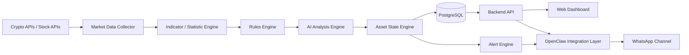
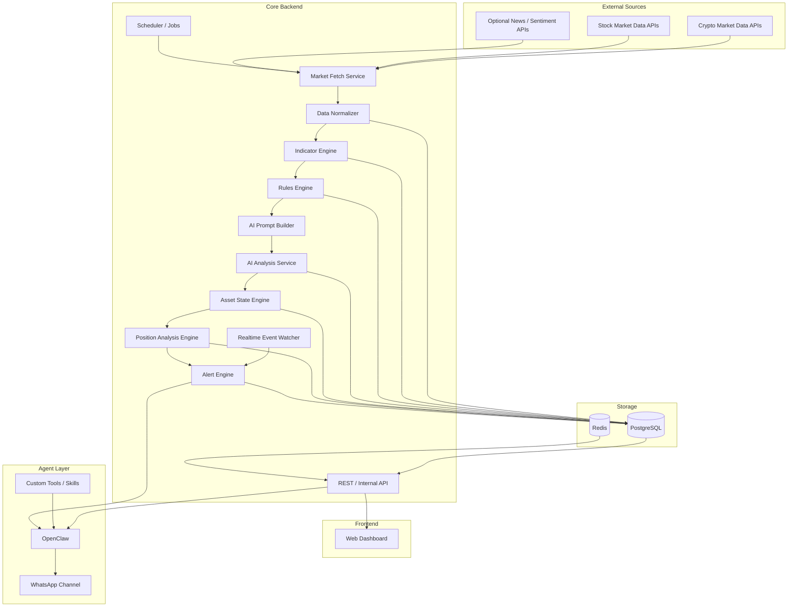
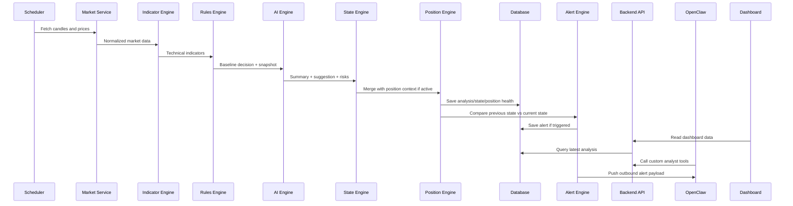

# AI Trading Analyst Dashboard — Product, User Flow, Architecture, and Tech Stack

## 1. Document Status

This document describes the revised product direction for the **AI Trading Analyst Dashboard** based on the following decisions:

- market scope starts with **crypto + stocks**
- phase 1 includes **analyst-only + alerts + manual position tracking**
- the main product is a **web dashboard**
- **OpenClaw** is integrated as the **chat / agent / notification layer**, with **WhatsApp as the target channel**
- trading execution still happens in the user's existing trading apps
- the stack should stay **pragmatic and flexible**, with a strong bias toward a web-based architecture that can evolve into a larger system later

---

## 2. Product Goal

Build a companion application that helps users:

- monitor multiple assets at the same time
- understand market conditions faster
- get structured trading suggestions
- receive important alerts without constantly opening charting or trading apps
- manually track active positions and receive state-aware analysis for those positions

This product is **not** the user's main trading platform in phase 1.

The user still buys and sells using existing trading apps such as:

- Binance
- Bybit
- Stockbit
- Ajaib
- other broker or exchange apps

The role of this product is:

- watchlist intelligence
- market analysis assistant
- decision support dashboard
- alerting and chat companion

---

## 3. Product Positioning

This product is **not**:

- an auto-trading bot
- a brokerage app
- a signal spammer that says buy/sell every minute

This product **is**:

> a multi-asset analyst assistant that continuously monitors a watchlist, evaluates setup quality, summarizes market state, helps manage manually tracked positions, and surfaces only the changes that matter.

The best mental model is:

> trading still happens in the trading app, while this system becomes the analysis brain and monitoring dashboard.

---

## 4. Product Scope

### Included in Phase 1

- crypto + stock watchlist monitoring
- scheduled technical/statistical analysis
- market state classification per asset
- structured suggestions for assets not yet bought
- structured suggestions for manually tracked positions
- alerting when important conditions or state changes occur
- web dashboard as the primary visual interface
- OpenClaw integration as conversational interface + notification layer
- WhatsApp as target chat channel for delivery

### Not Included Yet

- broker or exchange order execution
- approval workflow for live trades
- automatic buy/sell actions
- full portfolio accounting and PnL engine
- deep tax/accounting workflows
- advanced multi-user SaaS permission model

---

## 5. Core Product Idea

The system should not produce noisy opinions every minute for every watched asset.

Instead, the system should:

1. continuously analyze all watched assets
2. classify each asset into a usable state
3. rank what is worth attention now
4. produce a structured decision card for each asset
5. alert the user when something meaningful changes

So the real product output is not:

> "AI keeps talking nonstop about the market"

It is:

- **watchlist ranking**
- **asset decision cards**
- **alert feed**
- **position-aware suggestions**
- **chat-based access to the same intelligence through OpenClaw**

---

## 6. User Context Inputs

The system should support the following user-configured inputs.

### 6.1 Watchlist

A list of assets chosen by the user.

Examples:

- BTC
- ETH
- SOL
- NVDA
- TSLA
- AAPL
- BBCA
- BBRI

### 6.2 Trading Style

Examples:

- scalp
- intraday
- swing
- position

### 6.3 Risk Profile

Examples:

- conservative
- moderate
- aggressive

### 6.4 Timeframes

Examples:

- 5m
- 15m
- 1h
- 4h
- 1d

### 6.5 Manual Position Tracking Inputs

For positions the user already holds, the user can manually record:

- asset
- entry price
- current thesis or note
- optional stop loss
- optional target levels
- optional size / quantity
- optional source account / broker tag

This makes the system aware that the asset is no longer just a watch candidate, but an active position that needs a different suggestion model.

---

## 7. Business Flow

### Step 1 — User Builds a Watchlist

The user selects a group of assets across crypto and stocks.

Example:

- BTC
- ETH
- SOL
- NVDA
- TSLA
- AAPL
- BBCA
- BBRI
- AMZN
- META

The user also chooses a trading style, risk profile, and preferred monitoring cadence.

---

### Step 2 — System Monitors All Assets Continuously

The system runs two monitoring paths.

#### A. Scheduled Deep Analysis

Full analysis runs on intervals such as:

- every 5 minutes
- every 15 minutes
- every 1 hour
- every 4 hours

This path refreshes the full snapshot and suggestion state.

#### B. Realtime Event Monitoring

Realtime monitoring is used for event triggers such as:

- price enters watch zone
- price touches support or resistance
- breakout / breakdown
- volatility spike
- state transition threshold crossed

Realtime here does **not** mean the LLM is rethinking the market every tick.
It means the system is continuously watching for events that may justify a refresh or an alert.

---

### Step 3 — System Computes Technical and Statistical Signals

Before AI is involved, the system computes objective market features using deterministic code.

Examples:

- EMA 20 / 50 / 200
- RSI
- ATR
- support / resistance
- swing highs / lows
- volume trend
- volatility regime
- breakout / breakdown flags
- return windows (intraday / daily / weekly)

These outputs become the factual basis for the rest of the analysis.

---

### Step 4 — Rules Engine Produces a Baseline View

The rules engine applies deterministic logic such as:

- price above EMA200 => long-term bullish context
- price below EMA200 => bearish context
- price near resistance => avoid aggressive entry
- volatility too high => high-risk / no-trade bias
- uptrend + support hold + improving volume => setup quality increases

This layer is the safety baseline and should remain auditable.

---

### Step 5 — AI Interprets the Snapshot

The AI layer does **not** replace the technical engine.

It reads:

- the latest market snapshot
- rules engine output
- asset state
- position context if applicable

Then it helps with:

- natural-language explanation
- signal conflict summarization
- clear suggestion wording
- risk explanation
- concise “what to do now” framing

So AI is positioned as:

> analyst / interpreter

not:

> raw predictor or chart calculator

---

### Step 6 — System Classifies Each Asset into a State

Each asset should always have a clear state.

Suggested state model:

- `IGNORE`
- `WATCH`
- `PREPARE`
- `ACTIONABLE`
- `IN_POSITION`
- `EXIT_WARNING`
- `INVALID`

This makes the product more usable because the user can understand asset readiness at a glance.

---

### Step 7 — Alert Engine Surfaces Only Meaningful Changes

The alert engine should react to:

- state transitions
- event thresholds
- active-position risk changes
- strong setup confirmation or invalidation

Examples:

- `WATCH -> ACTIONABLE`
- `PREPARE -> INVALID`
- `IN_POSITION -> EXIT_WARNING`
- support broken
- breakout confirmed
- stop/invalidation zone approaching

This prevents spam and keeps the signal layer useful.

---

### Step 8 — Results Reach the User Through Two Interfaces

The user consumes the system in two main ways:

#### A. Web Dashboard

Used for:

- scanning the full watchlist
- opening detailed decision cards
- checking alert history
- managing manually tracked positions

#### B. OpenClaw Chat Layer

Used for:

- receiving alerts on WhatsApp
- asking natural-language questions about the watchlist
- getting summaries without opening the dashboard
- later, supporting approval-style flows if the product evolves beyond phase 1

---

## 8. Real Product Output

The product should be designed around three main output types plus one position layer.

### 8.1 Watchlist Ranking

Displays all assets with:

- state
- confidence
- short suggestion
- urgency
- last update

Example:

| Asset | State          | Confidence | Suggestion                          |
| ----- | -------------- | ---------: | ----------------------------------- |
| BTC   | WATCH          |         78 | Near support, wait for confirmation |
| ETH   | INVALID        |         42 | Structure weak, avoid entry         |
| SOL   | ACTIONABLE     |         84 | Breakout valid, setup improving     |
| NVDA  | PREPARE        |         73 | Approaching decision zone           |
| TSLA  | NOISE / IGNORE |         39 | Volatility too high                 |

This is the main scanning screen.

---

### 8.2 Asset Decision Card

When the user clicks an asset, the dashboard should show:

- asset name
- regime
- bias
- state
- confidence
- support / resistance / invalidation levels
- current plan framing
- summary
- reasons
- risks
- suggested next action

Example:

**BTC/USDT**

- Regime: Bullish
- State: WATCH
- Confidence: 78
- Support: 63,200
- Resistance: 63,450
- Suggestion: `ENTRY_ON_CONFIRMATION`

Summary:
Trend remains positive, but price is only now approaching support and volume has not yet confirmed an aggressive entry.

Risks:

- false bounce
- rejection near minor resistance
- volatility expansion

---

### 8.3 Alert Feed

A timeline of important events.

Example:

**BTC ALERT**  
State changed: `WATCH -> ACTIONABLE`  
Reason: valid reclaim of resistance with improving volume  
Suggestion: consider a small entry or wait for candle confirmation above breakout zone.

---

### 8.4 Position Panel

For manually tracked positions, the dashboard should show:

- active position state
- entry price
- optional stop / targets
- latest health assessment
- risks
- suggestion for the held position

Example:

**SOL/USDT**  
Position mode: Active  
State: `EXIT_WARNING`  
Suggestion: `TAKE_PARTIAL_PROFIT`  
Reason: momentum weakening near resistance while the higher-timeframe structure remains intact.

---

## 9. Suggestion Model by Case

Suggestions should be constrained and consistent.

### 9.1 Case A — User Does Not Yet Hold the Asset

Allowed suggestions:

- `NO_TRADE`
- `WATCH`
- `WAIT`
- `ENTRY_ON_CONFIRMATION`
- `ENTRY_SMALL`

Meaning:

- **NO_TRADE** => unattractive or too risky
- **WATCH** => becoming interesting, but no trigger yet
- **WAIT** => setup is plausible, timing is not good yet
- **ENTRY_ON_CONFIRMATION** => only if a specific level/trigger confirms
- **ENTRY_SMALL** => a light position is acceptable, but setup is not top-tier

### 9.2 Case B — User Has a Manually Tracked Position

Allowed suggestions:

- `HOLD`
- `HOLD_TIGHT`
- `REDUCE_RISK`
- `TAKE_PARTIAL_PROFIT`
- `EXIT_IF_BREAKS_LEVEL`
- `EXIT_NOW`

Meaning:

- **HOLD** => structure is still acceptable
- **HOLD_TIGHT** => continue holding but watch closely
- **REDUCE_RISK** => lighten exposure or protect downside
- **TAKE_PARTIAL_PROFIT** => secure part of gains
- **EXIT_IF_BREAKS_LEVEL** => exit only if a defined invalidation level breaks
- **EXIT_NOW** => thesis is invalid or risk has changed materially

---

## 10. Example User Flows

### Flow 1 — Morning Watchlist Screening

The user opens the dashboard in the morning.

The watchlist overview shows:

- BTC -> `WATCH`
- ETH -> `INVALID`
- SOL -> `ACTIONABLE`
- NVDA -> `PREPARE`
- TSLA -> `IGNORE`

The user immediately sees which assets deserve attention and which do not.

---

### Flow 2 — Opening a Decision Card

The user clicks SOL because it is `ACTIONABLE`.

The dashboard shows:

- trend remains bullish
- breakout recently confirmed
- volume improved
- entry zone and invalidation are defined
- suggestion: `ENTRY_ON_CONFIRMATION`

The user then decides whether to place a trade in the external trading app.

---

### Flow 3 — Passive Monitoring During the Day

The user stops watching charts.

The backend continues monitoring.

BTC transitions from `WATCH` to `ACTIONABLE`.

The user receives a WhatsApp alert through OpenClaw that explains:

- what changed
- why it changed
- what action is suggested
- what level invalidates the idea

---

### Flow 4 — Asking the Agent via Chat

The user sends a WhatsApp message to the OpenClaw-connected assistant:

- “Which assets in my watchlist are most actionable right now?”
- “Why is ETH invalid?”
- “Give me a short summary of BTC.”

The agent answers using backend data from the analyst system rather than improvising from scratch.

---

### Flow 5 — Position Monitoring

The user manually records a SOL position in the dashboard.

Later, SOL approaches resistance and momentum weakens.

The dashboard updates the position card to:

- state: `EXIT_WARNING`
- suggestion: `TAKE_PARTIAL_PROFIT`

An alert may also be delivered through OpenClaw/WhatsApp.

---

## 11. Architecture Overview



This highlights the core separation:

- the **trading analyst backend** computes the truth
- the **web dashboard** visualizes it
- **OpenClaw** acts as the conversational and notification shell

---

## 12. Detailed Technical Architecture



---

## 13. Component Responsibilities

### 13.1 Market Data Collector

Responsibilities:

- fetch OHLCV / candles
- fetch current price
- fetch volume and metadata
- normalize different provider formats across crypto and stocks

### 13.2 Indicator / Statistic Engine

Responsibilities:

- calculate EMA, RSI, ATR
- compute support/resistance zones
- calculate volatility / range expansion
- detect breakout / breakdown candidates
- produce technical features for scoring and interpretation

### 13.3 Rules Engine

Responsibilities:

- determine regime and bias baseline
- generate deterministic suggestions
- assign risk flags
- guard against noisy or contradictory setups

### 13.4 AI Analysis Engine

Responsibilities:

- read structured snapshot
- write summary and explanation
- produce human-readable reasons and risks
- translate raw technical context into concise suggestions

### 13.5 Asset State Engine

Responsibilities:

- assign current state to each asset
- track previous vs current state
- enforce consistent state transitions

### 13.6 Position Analysis Engine

Responsibilities:

- evaluate manually tracked positions
- generate position-aware suggestions
- identify exit warnings / reduce-risk conditions

### 13.7 Alert Engine

Responsibilities:

- detect meaningful changes
- prevent notification spam
- trigger structured alerts for dashboard and chat delivery

### 13.8 Backend API

Responsibilities:

- serve dashboard data
- expose internal endpoints for OpenClaw tools
- provide watchlist, asset detail, position detail, and alert feeds

### 13.9 Web Dashboard

Responsibilities:

- watchlist overview
- asset decision card views
- position monitoring views
- alert feed and history
- user configuration input

### 13.10 OpenClaw Integration Layer

Responsibilities:

- receive outbound alerts from the backend
- answer user questions through WhatsApp
- call custom tools to fetch grounded data from the backend
- apply skills to keep messaging consistent and safe

---

## 14. Why OpenClaw Is Integrated

OpenClaw should be used as the **agent shell**, not the core market-analysis engine.

### What OpenClaw Is Good For

- WhatsApp delivery and chat interface
- natural-language access to watchlist intelligence
- custom tools that call backend APIs
- skills that control response behavior and format
- memory for user preferences and conversational context
- hooks and automation support
- future approval-style interactions if the product grows into that phase

### What Stays in the App Core

- market data collection
- technical/statistical calculations
- rules engine
- asset state model
- position analysis
- alert logic
- database as source of truth

This keeps the analyst engine auditable and stable while letting OpenClaw provide a much better user interaction layer. Official OpenClaw docs describe it as a gateway with tools, skills, plugins, channels, memory, hooks, and multi-agent routing rather than a domain-specific market engine. citeturn280565search1turn280565search0turn305786search0turn280565search3

---

## 15. OpenClaw Integration Strategy

### 15.1 Role in the System

OpenClaw should sit beside the dashboard as:

- notification delivery channel
- chat-based query interface
- future workflow shell for confirmations or actions

### 15.2 Initial Use Cases

- send WhatsApp alerts when state changes
- answer “what is actionable right now?”
- explain why an asset is in a given state
- summarize top opportunities from the watchlist
- summarize active manually tracked positions

### 15.3 Custom Tools to Build

Suggested custom tools exposed from the backend to OpenClaw:

- `get_watchlist_overview`
- `get_asset_decision_card`
- `get_top_actionable_assets`
- `get_recent_alerts`
- `get_position_overview`
- `explain_asset_state`

### 15.4 Skills to Define

Suggested OpenClaw skills:

- analyst response format skill
- watchlist summary skill
- position suggestion skill
- alert explanation skill
- safety skill that avoids overstating certainty

### 15.5 Channel Choice

Target chat channel: **WhatsApp**.

OpenClaw supports channels such as WhatsApp and Telegram, provides a shared `message` capability for outbound delivery, and supports text-command behavior on surfaces like WhatsApp. citeturn280565search6turn280565search1turn305786search6

### 15.6 Security Boundary

OpenClaw should be treated as a high-privilege assistant layer.
If this system ever expands beyond a single trusted user, agent/channel isolation and trust boundaries must be designed carefully. OpenClaw’s own security docs explicitly warn that multiple people steering one tool-enabled agent share the same permission set unless isolated by stronger boundaries. citeturn280565search10turn305786search4

---

## 16. Data Flow



---

## 17. Analysis Strategy

### Principle

The AI layer should **not** analyze the market from raw candles alone.

Recommended pipeline:

1. fetch market data
2. compute indicators/statistics with deterministic code
3. apply rules engine
4. build a structured market snapshot
5. let the AI interpret that snapshot
6. persist the result and compare against prior state

Benefits:

- more stable than AI freestyle
- easier to audit
- easier to debug
- easier to test
- easier to explain to users

---

## 18. Dashboard Structure

### Page 1 — Watchlist Overview

Shows:

- all watched assets
- current state
- confidence
- short suggestion
- urgency
- last update

### Page 2 — Asset Detail

Shows:

- chart
- technical indicators
- regime / bias / state
- summary
- reasons
- risks
- support / resistance / invalidation
- recent alert history

### Page 3 — Position Monitor

Shows:

- manually tracked positions
- current position state
- suggestion and risk notes
- optional stop / targets
- health overview

### Page 4 — Alert Feed

Shows:

- latest alerts
- state transitions
- timestamps
- short reason
- linked asset detail

### Page 5 — Settings / Configuration

Shows:

- watchlist management
- style / risk preferences
- alert preferences
- OpenClaw / WhatsApp delivery settings

---

## 19. Finalized Phase 1 Technology Stack

These are the current engineering decisions for Sprint 1 and the Phase 1 baseline.

### Tooling / Monorepo

- **Bun** for package management, workspaces, and script running
- **Turborepo** for monorepo task orchestration and caching
- TypeScript across apps and shared packages
- Keep services **Node.js-compatible** during Phase 1 even if Bun is used as the package manager and task runner

### Frontend

- **Next.js** for the web dashboard
- TypeScript
- UI library flexible: Tailwind CSS + component library or another team-preferred setup
- charting library: TradingView Lightweight Charts, Recharts, or another pragmatic chart solution

### Backend

- **Fastify**
- TypeScript
- REST API first
- internal job workers for analysis and alerting
- schema-first request / response validation

### Storage

- **PostgreSQL** for core data and source of truth
- **Redis** for queueing, cache, and short-lived coordination

### Database Access

- **Drizzle ORM** as the default database layer
- SQL-first approach for schema and queries
- allow raw SQL / manual queries in performance-critical paths
- avoid heavy repository abstraction where direct SQL is clearer and faster

### Jobs / Scheduling

- **BullMQ + Redis**
- optional websocket/event watcher for realtime threshold detection

### Local Development Infrastructure

- **Docker Compose** for PostgreSQL and Redis in local development
- application services run from the monorepo during development

### Analysis / Domain Modules

- market data adapter layer for crypto + stock providers
- indicator engine (custom code or technical-analysis libraries)
- deterministic rules engine
- AI prompt builder + output parser
- state engine
- position analysis module
- alert module

### AI Layer

- LLM API for summarization and interpretation
- strongly structured prompts
- typed output schema and validation

### Chat / Agent Layer

- **OpenClaw**
- custom tools hitting backend API
- custom skills for response governance
- WhatsApp channel as primary target

### Observability / Ops

- structured logs
- error monitoring
- job metrics
- alert delivery logs
- audit trail for state changes and outbound messages

### Deployment Direction

- web app + backend services + database
- OpenClaw as a separate runtime/service
- internal or private deployment first before broader exposure

---

## 20. Suggested Project Structure

```text
/apps
  /web                 -> Next.js dashboard
  /api                 -> backend API
  /worker              -> scheduled analysis + alerts
  /openclaw-tools      -> backend/OpenClaw integration helpers

/packages
  /db                  -> Drizzle schema, migrations, database client, raw SQL helpers
  /market-data         -> crypto and stock data adapters
  /indicators          -> EMA, RSI, ATR, SR, volatility
  /rules-engine        -> deterministic decision logic
  /ai-analysis         -> prompt builder, parser, schemas
  /state-engine        -> asset state transitions
  /position-engine     -> manual position analysis
  /alert-engine        -> alert triggers and formatting
  /shared-types        -> shared TypeScript types

/infrastructure
  /docker
  /db
  /queue
  /observability
  /deployment
```

---

## 21. MVP Recommendation

Because the product starts with crypto + stocks and includes manual position tracking, the MVP should still stay narrow enough to validate quickly.

### Suggested MVP Scope

- support a small mixed watchlist (for example 3 crypto + 3 stocks)
- support 1H + 4H as core timeframes
- compute EMA, RSI, ATR, support/resistance, volatility
- support asset states:
  - `IGNORE`
  - `WATCH`
  - `PREPARE`
  - `ACTIONABLE`
  - `IN_POSITION`
  - `EXIT_WARNING`
  - `INVALID`
- support manual position tracking for a small number of active positions
- dashboard pages:
  - watchlist overview
  - asset detail
  - position monitor
  - alert feed
- OpenClaw integration:
  - one chat channel
  - basic watchlist queries
  - outbound WhatsApp alerts

### MVP Objective

Prove that:

- the user can monitor both crypto and stocks in one place
- the state model is more useful than raw indicator tables
- manual position tracking makes the assistant more valuable
- OpenClaw + WhatsApp reduces the need to constantly open the dashboard
- alerts are meaningful rather than noisy

---

## 22. Success Criteria

Phase 1 is successful if:

- the user can screen multiple assets quickly without feeling overwhelmed
- the dashboard surfaces the most actionable assets clearly
- manually tracked positions receive useful, differentiated suggestions
- alert frequency is manageable and not spammy
- the OpenClaw/WhatsApp experience is actually helpful in daily use
- the reasoning is understandable enough to support manual decision-making

---

## 23. Future Roadmap

### Phase 2

- richer position tracking
- performance review and alert quality analysis
- better natural-language querying through OpenClaw
- approval-oriented interaction design

### Phase 3

- approval-based action workflow
- broker/exchange integration for proposed actions
- semi-automated trade assistant with strict safeguards

### Phase 4

- deeper multi-agent role separation
- broader portfolio intelligence
- stronger workflow automation if risk controls and trust boundaries are mature enough

---

## 24. Philosophy

> AI should not replace the user's judgment.
> AI should make observation cleaner, analysis more consistent, and manual decisions easier to make.

And in this product specifically:

> the analyst engine owns market truth,
> the dashboard owns visibility,
> and OpenClaw owns conversational access and delivery.

---

## 18. Recommended MVP Operating Budget (Ideal Daily-Use Setup)

### Target Monthly Budget Range

For a realistic private/internal MVP used daily, the recommended target is:

- **Rp250.000 – Rp350.000 per month**

This range is designed to be:

- affordable enough for solo validation
- stable enough for daily use
- flexible enough for dashboard + backend + OpenClaw chat access

### Recommended Breakdown

#### A. Core Server

Recommended base server:

- **IDCloudHost Intel eXtreme — 2 core / 2 GB / 20 GB**
- Estimated cost: **Rp149.000 / month**

This server can host:

- backend API
- analysis engine
- PostgreSQL (self-hosted initially)
- OpenClaw runtime
- scheduler / worker

#### B. Cloudflare

- **Cloudflare Free**
- Estimated cost: **Rp0 / month**

Used for:

- DNS management
- SSL / HTTPS
- CDN for frontend assets
- basic DDoS / edge protection

#### C. Domain

Reserve budget:

- **Rp15.000 / month equivalent**
- roughly **Rp180.000 / year**

Used for:

- public dashboard URL
- API subdomain
- stable routing for OpenClaw / webhook integrations

#### D. AI / LLM Usage

Reserve budget:

- **Rp50.000 / month** for the initial ideal setup

This budget assumes:

- AI is called event-based, not every price tick
- AI is used for summary, explanation, ranking, and chat Q&A
- the system prefers cheap/fast models for routine tasks

#### E. Backup / Ops Buffer

Reserve budget:

- **Rp35.000 / month**

Used for:

- backup storage buffer
- logs or alert history growth
- small operational overhead

#### F. Additional Buffer

Reserve budget:

- **Rp25.000 / month**

Used for:

- unexpected usage spikes
- small tools / utilities / contingency

### Suggested Monthly Total

- **Rp274.000 / month** as the default planning number

This is the most practical planning figure for phase 1.

### Notes About Stock Market Data

For MVP/private/internal usage, use the cheapest acceptable source first.

However, stock market data may become the largest cost later if:

- the application becomes client-facing
- usage exceeds free/basic limits
- external display or commercial licensing is needed

So the phase-1 budget should assume:

- **keep stock data cost near zero or minimal at first**
- revisit this line item later when product usage is proven

---

## 19. LLM / AI Provider Strategy

### Why the document currently defaults to OpenAI first

The default recommendation is **not** because other models are bad.
It is because OpenAI is currently the most practical default for this specific MVP shape:

- backend analyst app
- event-driven summaries
- OpenClaw integration
- strong structured outputs
- reasonable API maturity and docs
- very cheap low-end models for routine tasks

The official OpenAI pricing page currently lists:

- **GPT-5.4 nano** at **$0.20 / 1M input tokens** and **$1.25 / 1M output tokens**
- **GPT-5.4 mini** at **$0.75 / 1M input tokens** and **$4.50 / 1M output tokens**

These are attractive for a system that needs many small structured calls rather than one giant reasoning job.

### Why not lock the system to only one provider

The application should **not** be tightly locked to a single AI vendor.
OpenClaw itself supports many providers and lets the default model be configured as `provider/model` rather than forcing one ecosystem.

That means the architecture should be built so that the AI layer is replaceable.

### Comparison at a practical level

#### OpenAI

Good fit when you want:

- strong structured output behavior
- reliable API ergonomics
- cheap small models for high-frequency light tasks
- easy fallback between nano / mini / stronger model tiers

Best use in this app:

- event summaries
- decision card explanation
- alert wording
- chat Q&A over existing analysis results

#### Gemini

Gemini is absolutely a valid option.
Google’s official Gemini pricing currently shows very competitive prices for Flash-class models, including low-cost input/output pricing on Gemini 2.5 Flash / Flash-Lite tiers.

Gemini becomes attractive when you want:

- aggressive cost efficiency
- very large context handling
- tight fit with Google ecosystem or Vertex AI

Potential tradeoffs for this project:

- OpenClaw + app integration needs to be tested for prompt/format behavior in your exact workflow
- some teams find model behavior and output formatting require more tuning depending on the task

Best use in this app:

- summarization
- ranking over larger context blocks
- cost-sensitive chat tasks

#### Grok / xAI

Grok is also a valid option and xAI’s official API pricing shows low-cost models like `grok-4-1-fast-reasoning` positioned for tool-calling use cases.

Grok becomes attractive when you want:

- tool-calling capable reasoning model alternatives
- another provider for failover or experimentation

Potential tradeoffs for this project:

- smaller ecosystem maturity for this specific product workflow compared with the most common production stacks
- you will want to verify structured output consistency, latency, and behavior against your trading prompt formats before making it the default

Best use in this app:

- experimentation
- fallback provider
- alternative chat/agent profile in OpenClaw

### Recommended model strategy for this product

The best approach is:

- **do not choose provider by hype**
- choose by **cost, structured output quality, tool-calling reliability, and stability in your workflow**

So the recommendation is:

#### Phase 1 default

Use:

- **OpenAI low-cost model as default routine model**
- for example nano/mini class for lightweight explanation and summaries

Because it gives a strong cost-to-reliability ratio for MVP work.

#### Phase 1.5 validation

Test the exact same prompts and outputs against:

- Gemini Flash / Flash-Lite
- Grok lightweight reasoning/tool-calling model

Then compare:

- formatting consistency
- state explanation quality
- hallucination rate in your domain
- latency
- cost per useful output

#### Phase 2+

Adopt multi-provider routing / fallback via OpenClaw if useful:

- one cheap model for routine summaries
- one stronger model for difficult explanations
- one fallback provider for resilience

### Final recommendation

For this project, the real reason to start with OpenAI is not “because it is the best at everything.”
It is because it is currently a **safe, cheap, practical default** for:

- structured API usage
- event-driven analysis summaries
- OpenClaw integration
- predictable MVP operations

But the architecture should remain **provider-agnostic** so that Gemini or Grok can be tested and adopted later if they prove better for your workload.

## 20. Provider Decision Matrix and Final Recommendation

### Goal

Choose the **best-fit default AI provider** for this product based on:

- structured output consistency
- cost for frequent small calls
- fit with OpenClaw
- stability for chat + alert workflows
- ease of replacing the provider later

### What OpenClaw means for this decision

OpenClaw can use many providers and selects models with the `provider/model` format.
That means this product should stay **provider-agnostic** and avoid hard-locking the architecture to one vendor.

### Decision Matrix

| Provider       | Best-fit role in this product                                          | Strengths                                                                                                              | Weaknesses / cautions                                                                                                     | Verdict                                  |
| -------------- | ---------------------------------------------------------------------- | ---------------------------------------------------------------------------------------------------------------------- | ------------------------------------------------------------------------------------------------------------------------- | ---------------------------------------- |
| **OpenAI**     | Default routine analysis, alert wording, OpenClaw chat baseline        | Cheap small models, mature API/docs, strong structured output behavior, easy tiering between nano/mini/stronger models | Not always the absolute cheapest in every scenario                                                                        | **Best default starting point**          |
| **Gemini**     | Cost-down alternative, batch recap, large-context summaries            | Competitive pricing, free tier exists, large quotas/rate limits on some models                                         | Model lineup and preview tiers can require more testing; exact formatting behavior should be benchmarked in this workflow | **Best cost-efficiency challenger**      |
| **Grok / xAI** | Experimental agent/chat alternative, fallback, tool-calling comparison | Tool-calling-focused lightweight model exists, interesting for agent-style interaction                                 | Needs more benchmarking for structured output consistency and exact fit in this product flow                              | **Good experimental / secondary option** |

### Why OpenAI is the strongest default right now

OpenAI is still the strongest default for this exact MVP shape because the workload is mostly:

- many **small structured calls**
- event-driven summaries
- alert wording
- Q&A over existing analysis
- OpenClaw chat interaction over app-owned tools

The official OpenAI pricing currently lists:

- **GPT-5.4 nano** at **$0.20 / 1M input tokens** and **$1.25 / 1M output tokens**
- **GPT-5.4 mini** at **$0.75 / 1M input tokens** and **$4.50 / 1M output tokens**

That pricing shape is especially attractive for this app because the system should not call a large reasoning model on every market tick.

### Why Gemini is the best alternative to test next

Gemini is the best next provider to benchmark if the goal becomes:

- reducing routine cost further
- handling larger summaries
- building batch recaps or digest-style outputs
- exploring generous quotas / throughput

Google’s Gemini pricing page currently shows a **free tier** and paid plans with higher rate limits, while the Gemini billing docs confirm billing is based on input tokens, output tokens, cached tokens, and cache storage.
The Gemini rate-limit page also shows very large batch token allowances for several Flash / Flash-Lite / Pro families.

That makes Gemini the **strongest cost-down candidate** after the baseline is stable.

### Why Grok is not the default first choice

xAI’s API pricing page does show a lightweight model, **grok-4-1-fast-reasoning**, priced at **$0.20 / 1M input**, **$0.20 / 1M cached input**, and **$0.50 / 1M output**, and xAI positions it as a cost-efficient lightweight model that excels at tool-calling.

That is genuinely interesting for agent-style chat.

However, for this project, Grok is still better treated as:

- a benchmark candidate
- an alternative chat profile
- a fallback provider
- an experiment for tool-calling UX

rather than the first production default, because the product still needs to prove structured output consistency and behavior against our asset-state / suggestion schema.

### Final provider recommendation

#### Default production recommendation for MVP

Use:

- **OpenAI GPT-5.4 nano** for routine per-asset explanations, alert wording, state summaries, and low-cost background calls
- **OpenAI GPT-5.4 mini** for OpenClaw conversational Q&A, richer summaries, and cases where wording/format reliability matters a little more

#### Provider strategy after MVP stabilizes

Then benchmark:

- **Gemini** as the main cost-down or batch-summary challenger
- **Grok** as the main agent/chat-style challenger

#### Architectural rule

The application must keep:

- provider-agnostic AI adapter layer
- provider/model configuration in settings
- prompt and output schema separated from provider implementation
- room for A/B testing and fallback routing later

### Practical conclusion

If the goal is **the most suitable and safest choice right now**, the answer is:

> **Start with OpenAI as the default provider.**

Not because it is automatically best at everything,
but because it is the most practical fit for:

- small frequent structured calls
- OpenClaw integration
- predictable MVP cost
- low-friction implementation

Then:

> **test Gemini second for cost efficiency**, and  
> **test Grok third for agent/tool-calling UX**.

---

## 23. Development Phases & Engineering TODO

This section turns the product direction into a practical build order.

The goal is not to build everything at once.
The goal is to build the smallest version that already feels useful, then layer on reliability, chat access, and richer workflows.

---

### Phase 0 — Foundation & Product Validation

**Goal:**
Set up the repo, environments, basic infrastructure, and decision boundaries before writing too much feature code.

**Primary outcome:**
A development environment where the app, backend, database, and core analysis jobs can run locally and in a small hosted environment.

#### Product TODO

- Finalize the phase 1 scope: analyst + alerts + manual position tracking
- Finalize the initial market scope: crypto + stocks
- Finalize the initial watchlist constraints for MVP
- Finalize the first output schema for asset decision cards
- Finalize the asset state machine for phase 1
- Finalize the recommendation vocabulary for no-position and in-position states

#### Architecture / Engineering TODO

- Create monorepo with **Bun workspaces** and **Turborepo**
- Create project structure for frontend, backend, shared types, database package, and worker jobs
- Define environment variables and secret handling strategy
- Set up **Docker Compose** for PostgreSQL and Redis locally
- Set up PostgreSQL in the target hosted environment
- Set up basic CI checks for linting, type-checking, and tests
- Establish **Fastify** as the backend framework
- Establish **Drizzle** as the SQL-first database layer
- Establish **BullMQ** as the scheduler/job runner
- Add initial logging and error handling conventions

#### Deliverables

- Repo initialized
- Local development environment works
- Database connection works
- Shared types package or shared model layer exists
- Deployment target for MVP is chosen

---

### Phase 1 — Core Analyst Engine (MVP Core)

**Goal:**
Make the system able to scan selected assets, compute signals, assign states, and return structured analysis without OpenClaw yet being the center of the experience.

**Primary outcome:**
A backend that can analyze assets on schedule and store the result.

#### Backend TODO

- Build market data collector for crypto
- Build market data collector abstraction for stock provider integration
- Normalize market data into one internal schema
- Store raw or normalized candle snapshots as needed for analysis
- Implement indicator engine:
  - EMA 20 / 50 / 200
  - RSI
  - ATR
  - volume trend
  - support / resistance baseline logic
- Implement rules engine:
  - regime detection
  - bias determination
  - no-position suggestion baseline
  - risk flag generation
- Implement asset state engine:
  - IGNORE
  - WATCH
  - PREPARE
  - ACTIONABLE
  - INVALID
- Implement analysis result persistence
- Expose internal API endpoints for latest analysis and asset detail

#### Data / Model TODO

- Define `Asset`
- Define `MarketSnapshot`
- Define `IndicatorSnapshot`
- Define `AssetAnalysis`
- Define `AssetStateTransition`
- Define `UserWatchlist`
- Define `UserPreference`

#### Product Logic TODO

- Define confidence scoring baseline
- Define short summary rules
- Define risk wording rules
- Define state transition rules that avoid noisy flipping
- Define minimum data freshness requirements per market/timeframe

#### Deliverables

- Scheduled analysis job works
- Each watched asset receives a structured analysis result
- State transitions are stored
- Backend API can serve current watchlist analysis

---

### Phase 2 — Approval & Action Layer (OpenClaw Browser-Based)

Pada fase ini, aplikasi tetap mempertahankan backend analyst sebagai sumber keputusan dan OpenClaw sebagai chat/approval shell, tetapi **jalur action tidak menggunakan broker/exchange API resmi**. Sebagai gantinya, action dilakukan melalui **OpenClaw browser automation** pada permukaan web broker/exchange yang digunakan user.

### Tujuan

- mempertahankan alur approval oleh user
- memungkinkan OpenClaw membantu menjalankan action melalui browser
- tetap menjaga backend analyst sebagai source of truth untuk signal, risk, dan state

### Prinsip Desain

- **AI tidak langsung mengeksekusi action tanpa approval user**
- browser automation dipakai sebagai **execution surface**
- backend analyst tetap menghitung suggestion, risk, dan recommended action
- OpenClaw bertugas:
  - menanyakan approval
  - membuka halaman yang tepat
  - mengisi action yang diperlukan
  - menjalankan action browser setelah approval
  - mengembalikan hasil eksekusi ke sistem

### Target Actions

Action yang dapat dilakukan pada fase ini:

- membuka halaman asset di broker/exchange web
- menyiapkan form order
- mengisi draft buy/sell
- mengubah stop loss / take profit
- close / reduce posisi
- cancel pending order

### Flow

1. analyst engine mendeteksi kondisi actionable
2. alert / chat assistant menghubungi user
3. user memberikan approval
4. OpenClaw browser membuka web broker/exchange
5. OpenClaw melakukan step browser yang diperlukan
6. hasil action dicatat ke sistem sebagai execution record
7. posisi / alert / state diperbarui

### Guardrails

Karena jalur action berbasis browser lebih rapuh daripada API resmi, Phase 2 wajib memiliki guardrails:

- approval eksplisit dari user
- action hanya pada broker/exchange yang didukung
- retry dan verification step setelah click/type
- execution record tersimpan
- fail state jelas jika UI berubah / login gagal / selector rusak
- browser action bisa dibatalkan user

### Keterbatasan

- lebih rapuh dibanding integrasi API resmi
- sensitif terhadap perubahan UI broker/exchange
- bisa terganggu oleh login challenge, captcha, popup, atau 2FA
- memerlukan maintenance lebih sering pada browser workflow

### Rekomendasi Penggunaan

Browser-based action cocok bila:

- user tetap nyaman memakai web broker/exchange
- ingin phase action tanpa integrasi broker API
- ingin OpenClaw bertindak sebagai operator yang dibatasi approval

Browser-based action **tidak** boleh menggantikan:

- analyst engine
- risk engine
- state engine
- execution logging

### Deliverables Phase 2

- approval flow di chat/dashboard
- OpenClaw browser workflow per broker/exchange target
- execution record dan audit trail
- position update setelah action
- failure handling untuk browser action
- human-in-the-loop safeguards

## 24. Build Order Recommendation

If development bandwidth is limited, the best order is:

1. **Phase 0** — foundation
2. **Phase 1** — core analyst engine
3. **Phase 2** — web dashboard
4. **Phase 3** — manual position tracking
5. **Phase 4** — AI interpretation layer
6. **Phase 5** — OpenClaw integration
7. **Phase 6** — hardening

This order keeps the product grounded.
It ensures the system is already useful before chat integration becomes the center of the experience.

---

## 25. MVP Definition

A realistic MVP for this project is complete when all of the following are true:

- user can maintain a watchlist of crypto + stocks
- backend can analyze watched assets on a schedule
- dashboard shows watchlist ranking and asset decision cards
- user can manually log active positions
- system changes its suggestion style for in-position assets
- alerts are generated on meaningful state change
- AI improves summary and explanation quality
- OpenClaw can answer watchlist and alert questions through chat

Anything beyond that is an upgrade, not a requirement for MVP.

---

## 26. Suggested Ownership Buckets

If the project grows beyond one builder, work can be split into these tracks:

### Product / Decision Logic

- asset states
- suggestion model
- alert policy
- user flow
- position semantics

### Backend / Data

- market data ingestion
- indicators
- rules engine
- persistence
- internal APIs

### Frontend / Dashboard

- watchlist UI
- asset detail UI
- alerts UI
- settings and positions UI

### AI / OpenClaw

- prompts
- provider abstraction
- skills
- tool definitions
- chat flows

### Infra / Ops

- deployment
- backups
- monitoring
- security
- secrets

---

## 27. Recommended First Sprint

If there is only one immediate sprint to start from, the best first sprint is:

- repo setup
- database setup
- market data fetcher for crypto + one stock provider
- indicator engine baseline
- rules engine baseline
- watchlist analysis API
- simple CLI or JSON output to verify usefulness before building the full UI

This reduces the risk of building a nice dashboard before the analysis core is actually helpful.

## 28. Precision Strategy: Beyond Technical Analysis

The product should not stop at technical/statistical analysis only.

Technical analysis remains the foundation, but the long-term value of the application comes from becoming a **multi-factor decision support system**, not just an AI chart reader.

In practice, this means the app should combine:

- market structure / technical signals
- contextual drivers
- event risk
- asset-specific objective factors
- AI interpretation

The goal is not to add as many indicators as possible.
The goal is to improve decision precision by layering the **right kinds of information**.

### Why Technical Analysis Alone Is Not Enough

Technical/statistical analysis is very useful for answering questions like:

- what trend is the asset in?
- is price near support or resistance?
- is momentum strengthening or weakening?
- is volatility high or normal?
- is there a breakout or breakdown?

But technicals alone are often weak at answering questions like:

- why is the asset moving?
- is this move supported by macro or company/project context?
- is there an event risk that can invalidate the setup soon?
- is this a structurally strong move or only a temporary hype-driven move?
- are there objective non-technical factors that contradict the chart?

Because of that, the app should evolve from:

> AI chart assistant

into:

> AI market decision assistant

---

## 29. Layered Analysis Model

To make decisions more precise, the product should follow a layered approach.

### Layer 1 — Market Structure Layer

This remains the foundation.

Focus:

- price action
- trend
- support / resistance
- momentum
- volatility
- breakout / breakdown
- volume behavior

Question answered:

> What is the market doing right now?

### Layer 2 — Context Layer

This adds objective non-technical context that may support or contradict the setup.

Question answered:

> Is the current technical setup supported or weakened by broader context?

### Layer 3 — Risk Layer

This detects objective risks that may make an otherwise good-looking setup unsafe.

Focus:

- upcoming event risk
- abnormal volatility
- liquidity risk
- contradiction across factors
- regime uncertainty

Question answered:

> Even if the setup looks good, how risky is it to act on it?

### Layer 4 — AI Decision Interpretation Layer

AI should read the outputs of the previous layers and convert them into:

- concise explanation
- ranked drivers
- conflicts between factors
- final actionable suggestion
- confidence

Question answered:

> Given all objective inputs, what is the clearest and most rational interpretation for the user?

---

## 30. Objective Factor Expansion by Asset Class

The app should gradually support additional non-technical factors.

### For Stocks

High-value objective factors include:

- earnings calendar
- earnings surprise / guidance direction
- company news
- macro calendar (CPI, FOMC, rates, labor data)
- sector strength / sector-relative performance
- simple valuation snapshot
- revenue / earnings growth snapshot
- balance sheet quality snapshot
- corporate actions (buybacks, splits, dividends, M&A)

These factors help answer:

- is the chart aligned with company/business reality?
- is an event likely to distort the setup?
- is the stock strong relative to its sector or only moving with the market?

### For Crypto

High-value objective factors include:

- funding rate
- open interest
- liquidation pressure / derivative heat proxy
- token unlock schedule
- exchange inflow / outflow
- BTC regime / BTC dominance context
- major regulatory/news risk
- on-chain activity summary
- staking / supply lock dynamics
- project-specific event calendar

These factors help answer:

- is the move driven by healthy demand or overheated speculation?
- is there supply pressure coming soon?
- is the coin moving with strong market context or only temporary momentum?

---

## 31. What the App Should Optimize For

Every new factor added to the system should justify itself through at least one of these outcomes:

1. improve decision accuracy
2. reduce bad decisions
3. improve explanation quality

If a new signal does not clearly do one of those, it should not be added early.

This prevents the product from turning into an over-engineered indicator dump.

---

## 32. Suggested Multi-Factor Output Format

The application should eventually explain asset decisions using grouped drivers, not only one generic summary.

Example:

```text
Asset: BTC/USDT
State: WATCH
Confidence: 74

Technical:
- Bullish structure on 4H
- Price near support
- Momentum neutral to slightly positive

Context:
- Funding slightly overheated
- Macro neutral today
- No immediate major regulatory headline

Risk:
- Resistance overhead is close
- Event risk increases tomorrow due to macro release

Decision:
- WAIT / ENTRY_SMALL

Reason:
- Technical setup is decent, but derivative heat and near-term event risk make aggressive entry less attractive.
```

This format is much more useful than a plain “bullish / bearish” tag.

---

## 33. Multi-Factor Scope by Phase

To avoid over-complexity, the factor set should be introduced gradually.

### Phase 1 — Foundation (Must Have)

Include:

- technical / market structure layer
- event calendar basics
- major news risk flags
- manual position tracking
- AI interpretation on top of deterministic outputs

### Phase 2 — High-Value Context

Stocks:

- earnings calendar
- company news
- sector-relative strength
- simple fundamentals snapshot

Crypto:

- funding rate
- open interest
- token unlock calendar
- market-wide crypto regime context

### Phase 3 — Advanced Context & Risk

Stocks:

- deeper valuation / fundamental trend comparison
- macro linkage scoring
- industry rotation context

Crypto:

- exchange flow summaries
- on-chain activity summaries
- derivative heat score
- project-specific event calendar

### Phase 4 — Precision Optimization

Add only after measuring real value:

- factor weighting refinement
- contradiction scoring
- confidence calibration
- better ranking logic across all watchlist assets

---

## 34. Recommended Product Positioning Update

The product should now be positioned as:

> a multi-factor analyst and decision-support system for stocks and crypto,
> with technical analysis as the foundation,
> contextual and event-driven analysis as precision layers,
> and AI as the final interpretation layer.

That framing is stronger and more differentiated than describing it as a technical-analysis-only AI tool.

---

## 35. Engineering Impact of This Direction

Because the product is no longer technical-only, the architecture should continue to separate:

- deterministic data collection
- factor computation
- state / rules logic
- AI interpretation

This means future expansion should likely introduce dedicated modules such as:

- `event-engine`
- `news-risk-engine`
- `macro-context-engine`
- `equity-fundamentals-engine`
- `crypto-context-engine`
- `risk-scoring-engine`

These modules do not all need to exist immediately, but the architecture should keep room for them.

---

## 36. Development Guidance for the New Direction

The team should avoid making the app “smarter” by only adding more indicators.

Instead, precision should increase through:

- better factor layering
- better conflict detection across factors
- better event awareness
- better explanation quality
- better risk gating

Guiding principle:

> precision should come from layered analysis,
> not from piling up indicators.

## 20. API Strategy — Primary and Backup Providers

### 20.1 Does one API already cover everything?

No.

No single provider cleanly covers all of the following with the same quality level:

- crypto spot market data
- stock market data
- macro/economic data
- stock fundamentals and event calendars
- crypto derivatives metrics such as funding/open interest/liquidations
- crypto on-chain metrics
- broad news/search and sentiment context

The system should therefore use a **small set of primary APIs** plus **backup/alternative providers**.

### 20.2 Recommended primary APIs for this product

#### A. Crypto market data

**Primary:** Binance API

Use for:

- spot price and ticker data
- OHLCV / candlestick data
- real-time WebSocket market streams
- basic order book and market structure monitoring

Why:

- strong public market-data coverage for crypto
- mature REST + WebSocket docs
- best fit for phase 1 crypto analysis engine

#### B. Stock market data

**Primary:** Twelve Data

Use for:

- stock OHLCV / historical candles
- multi-asset market data (stocks, ETF, forex, crypto)
- some fundamental data coverage
- optional technical-indicator endpoints if needed

Why:

- unified multi-asset coverage
- practical for a mixed crypto + stock watchlist
- good fit as the main stock market-data layer

#### C. Macro / economic context

**Primary:** FRED API

Use for:

- rates and yield series
- inflation and unemployment series
- macro backdrop for risk-on / risk-off interpretation

Why:

- authoritative macro/economic source
- enough for phase 1 macro context

#### D. AI reasoning / structured explanation

**Primary:** OpenAI API

Use for:

- routine analysis summarization
- alert wording
- OpenClaw chat responses
- reasoning over structured multi-factor snapshots

Why:

- strong fit for structured output and routine event-driven prompts
- current default provider for MVP

#### E. Agent / chat / notification layer

**Primary:** OpenClaw

Use for:

- WhatsApp / conversational interface
- command and query layer
- future approval flow shell
- message delivery and orchestration

Why:

- not a market-data provider, but the primary chat/orchestration layer for the app

### 20.3 Recommended backup / alternative APIs

#### Crypto market data alternatives

- Twelve Data (backup for basic crypto time series)
- exchange-specific alternatives later if needed

#### Stock market data alternatives

- Alpha Vantage
- Finnhub (strong candidate for earnings calendar, company news, fundamentals, and market data expansion)

#### Macro alternatives

- Alpha Vantage economic indicators
- Finnhub economic calendar/data

#### Crypto derivatives / sentiment context alternatives

- CoinGlass for funding rate, open interest, liquidations, long/short ratios, and derivatives context

#### Crypto on-chain alternatives

- CryptoQuant for exchange flows, aggregate on-chain metrics, and additional crypto context

#### News / event context alternatives

- Finnhub company news + earnings calendar for stocks
- NewsAPI for broad article discovery/search across many publishers
- Alpha Vantage market news & sentiment as another general news/sentiment option

### 20.3 phase 1 API set (recommended)

To avoid overengineering, phase 1 should use only the minimum useful API set:

- **Binance** → crypto prices, candles, realtime streams
- **Twelve Data** → stock market data
- **FRED** → macro context
- **OpenAI** → reasoning and explanation
- **OpenClaw** → chat / WhatsApp / delivery shell

Optional phase-1.5 additions:

- **Finnhub** → stock earnings calendar and company news
- **CoinGlass** → crypto derivatives context

### 20.5 When additional APIs become necessary

Add extra providers only when the product needs them:

- add **Finnhub** when stock event risk and company-news context become important
- add **CoinGlass** when crypto derivatives context becomes important
- add **CryptoQuant** when on-chain context becomes important
- add **NewsAPI** when broader news/event scanning becomes important
- add **Alpha Vantage** mainly as fallback / backup / prototyping support

### 20.6 Principle for API selection

The product should stay:

- provider-agnostic at the architecture level
- conservative in the number of vendors used in phase 1
- explicit about which provider is source-of-truth for each data category
- able to fall back to alternatives if the primary provider becomes unreliable, expensive, or insufficient

### 20.7 Phase 1 source-of-truth mapping

| Category                   | Primary API                | Backup / Alternative                 |
| -------------------------- | -------------------------- | ------------------------------------ |
| Crypto OHLCV / realtime    | Binance                    | Twelve Data                          |
| Stocks OHLCV / historical  | Twelve Data                | Alpha Vantage / Finnhub              |
| Macro / economics          | FRED                       | Alpha Vantage / Finnhub              |
| Stock event/news context   | Finnhub (when enabled)     | NewsAPI / Alpha Vantage              |
| Crypto derivatives context | CoinGlass (when enabled)   | exchange-specific alternatives later |
| Crypto on-chain context    | CryptoQuant (when enabled) | other on-chain vendors later         |
| AI reasoning               | OpenAI                     | Gemini / Grok                        |
| Chat / agent layer         | OpenClaw                   | direct app notifications if needed   |

## Development Phases

Produk ini dibagi menjadi **2 phase**.

### Phase 1 — Core Analyst MVP & Intelligence Expansion

Phase ini mencakup semua fondasi utama dan gelombang intelligence expansion awal. Tujuannya adalah membuat aplikasi sudah benar-benar berguna sebagai **AI market decision assistant** untuk crypto dan saham.

Scope utama:

- core analyst MVP:
  - web dashboard
  - watchlist multi-asset
  - technical/statistical engine
  - manual position tracking
  - alert feed
- intelligence expansion in the same product phase:
  - context engine dasar
  - risk engine dasar
  - OpenClaw integration sebagai chat/notification layer
  - WhatsApp/chat command dasar
  - primary API integration
  - provider-agnostic AI layer

Deliverables:

- watchlist overview
- asset decision card
- state engine per aset
- alert on state change
- OpenClaw chat untuk query seperti ringkasan watchlist, detail aset, dan alert summary
- dashboard + backend + database berjalan stabil

### Phase 2 — Approval & Action Layer

Phase ini baru masuk ke area semi-automation setelah analyst platform dan precision layer stabil.

Scope utama:

- approval flow
- conversational confirmation via OpenClaw / WhatsApp
- action recommendation workflow
- execution preparation layer
- audit trail yang lebih ketat
- role/permission boundary untuk aksi

Deliverables:

- ask-confirm-act flow
- approval messages
- action log
- execution-safe architecture boundary

## Final Phase Structure

The roadmap is intentionally simplified into 2 phases:

### Phase 1 — Core Analyst MVP & Intelligence Expansion

Phase 1 includes the full MVP and the first meaningful intelligence layer needed to make decisions more precise. This phase covers:

- multi-asset watchlist dashboard
- technical/statistical analysis
- context analysis dasar (macro, events, news/fundamental snapshots where applicable)
- risk scoring dasar
- multi-factor decision support
- alerting
- manual position tracking
- OpenClaw chat / WhatsApp-facing analyst interaction

### Phase 2 — Approval & Action Layer

Phase 2 starts only after the analyst product is stable and useful. This phase covers:

- approval / confirmation flow
- action orchestration
- guarded execution hooks
- audit trail for approvals/actions
- policy and permission boundaries

---

## Positions Module (Manual Action Record & Monitoring)

Untuk MVP, karena user masih melakukan buy/sell di aplikasi trading eksternal, aplikasi ini perlu memiliki modul **Positions** agar setiap action manual user bisa dicatat dan kemudian dipantau oleh analyst engine.

### Tujuan Modul Positions

- mencatat action manual user setelah entry/exit di aplikasi trading luar
- mengubah mode analisis dari _watchlist mode_ menjadi _position monitoring mode_
- memberi suggestion yang relevan untuk posisi aktif
- menyimpan histori posisi untuk evaluasi keputusan di masa depan

### Core Pages

#### 1. Positions List Page

Halaman ini menampilkan seluruh posisi yang sedang aktif maupun yang sudah ditutup.

**Fungsi utama:**

- melihat semua posisi terbuka
- melihat riwayat posisi yang sudah ditutup
- memantau P/L sederhana
- melihat state dan suggestion terbaru dari agent untuk setiap posisi

**Informasi minimum yang ditampilkan:**

- asset
- position status: open / closed
- entry price
- current price
- unrealized P/L atau realized P/L
- latest agent state
- latest suggestion
- updated at

**Contoh use case:**

- user ingin melihat posisi mana yang sedang sehat
- user ingin melihat posisi mana yang masuk `REDUCE_RISK`
- user ingin melihat histori posisi yang pernah diambil

#### 2. Record Position Page

Halaman/form untuk mencatat action manual user setelah melakukan transaksi di aplikasi trading eksternal.

**Fungsi utama:**

- record posisi baru
- record penambahan posisi
- record close posisi
- update stop loss / take profit
- update note/manual context

**Field minimum:**

- asset
- action type: BUY / SELL / CLOSE
- entry date/time
- entry price
- quantity / nominal (optional untuk MVP awal)
- stop loss (optional)
- take profit (optional)
- notes (optional)

**Contoh use case:**

- user membeli SOL di Binance, lalu masuk ke app ini untuk mencatat entry
- user menutup posisi NVDA, lalu mencatat exit supaya histori tersimpan

#### 3. Position Detail Page

Halaman detail untuk satu posisi tertentu.

**Fungsi utama:**

- melihat data entry posisi
- melihat current context posisi
- melihat suggestion agent khusus posisi tersebut
- melihat timeline perubahan state dan alert yang relevan

**Informasi minimum:**

- entry information
- current price vs entry price
- unrealized / realized P/L
- technical summary
- context summary
- risk summary
- current agent suggestion
- position alert history

### Position Monitoring Mode

Setelah posisi dicatat, sistem tidak lagi memperlakukan aset itu hanya sebagai bagian dari watchlist biasa.

Suggestion untuk posisi aktif berubah menjadi lebih relevan terhadap posisi, misalnya:

- `HOLD`
- `REDUCE_RISK`
- `EXIT_WARNING`

Dengan begitu, aplikasi tidak hanya membantu user **sebelum entry**, tetapi juga **setelah entry**.

### Integration with Watchlist & Alerts

- Watchlist membantu user memilih aset yang menarik
- Record Position mengubah aset terpilih menjadi posisi aktif
- Positions List membantu user memantau semua posisi
- Position Detail membantu user memahami kondisi satu posisi secara mendalam
- Alert Engine perlu mendukung alert yang spesifik untuk posisi aktif

### MVP Scope for Positions

Yang masuk Phase 1:

- positions list
- record new position form
- position detail
- open vs closed positions
- basic P/L display
- agent suggestion untuk posisi aktif

Yang belum masuk Phase 1:

- auto-sync ke broker/exchange
- execution dari aplikasi ini
- portfolio management kompleks
- auto journal analytics yang mendalam

### Navigation Recommendation

Agar product flow jelas, menu utama yang direkomendasikan adalah:

- Watchlist
- Positions
- Alerts
- Chat Assistant

Di dalam **Positions**, direkomendasikan ada:

- **Open Positions**
- **Closed Positions**
- tombol **Record New Position**

---

## Chat-Based Action Record via OpenClaw (WhatsApp Flow)

Selain melalui dashboard, aplikasi juga perlu mendukung **quick action record** melalui WhatsApp/OpenClaw. Ini penting untuk skenario ketika user sedang mobile atau tidak sedang membuka dashboard, tetapi tetap ingin mencatat action yang sudah dilakukan di aplikasi trading eksternal.

### Tujuan

- memungkinkan user mencatat action dengan cepat cukup melalui balasan chat
- menjadikan OpenClaw bukan hanya alert channel, tetapi juga **quick position record channel**
- memastikan setiap action manual user tetap masuk ke sistem dan mengubah mode analisis menjadi **position monitoring**

### Konsep

Flow yang diharapkan:

1. analyst engine mendeteksi aset dalam kondisi penting (`ACTIONABLE`, `EXIT_WARNING`, dll)
2. OpenClaw mengirim alert ke WhatsApp
3. user melakukan action di aplikasi trading eksternal
4. user membalas chat OpenClaw untuk mencatat action
5. sistem menyimpan record posisi dan mengaktifkan monitoring posisi

### Contoh Flow

**OpenClaw**

- SOL/USDT berubah `PREPARE` → `ACTIONABLE`
- Saran: `ENTRY_ON_CONFIRMATION`

**User membalas:**

- `BUY SOL 148.2`
- `BUY SOL 148.2 qty 10`
- `BUY SOL 148.2 sl 145.9 tp 152`
- `CLOSE SOL 151.4`
- `UPDATE SL SOL 146.5`
- `REDUCE SOL 50%`

### Fungsi OpenClaw di Flow Ini

- menerima balasan user
- melakukan parsing command atau pesan natural yang masih cukup jelas
- jika data belum lengkap, meminta klarifikasi singkat
- membentuk action record terstruktur
- mengirim record ke backend analyst app
- mengaktifkan / memperbarui **position monitoring mode**

### Minimal Data yang Perlu Ditangkap

- asset
- action type: BUY / SELL / CLOSE / UPDATE SL / UPDATE TP / REDUCE
- execution price (jika relevan)
- timestamp
- quantity / nominal (opsional)
- stop loss / take profit (opsional)
- note (opsional)

### UX Principle

- **WhatsApp/OpenClaw = fast lane**
- **Dashboard = full control**

Artinya:

- chat dipakai untuk quick record dan quick update
- dashboard dipakai untuk melihat histori lengkap, mengedit detail, dan memantau posisi secara penuh

### Dampak ke Position Monitoring

Begitu action berhasil direcord melalui chat:

- aset masuk ke **Positions**
- status analisis untuk aset tersebut berubah dari watchlist mode ke position mode
- suggestion yang diberikan agent ikut berubah, misalnya:
  - `HOLD`
  - `REDUCE_RISK`
  - `EXIT_WARNING`

### Kelebihan

- lebih natural untuk user mobile
- tidak memaksa user selalu membuka dashboard
- mempercepat pencatatan action
- membuat OpenClaw lebih benar-benar terasa sebagai companion assistant

### Batas Phase 1

Yang masuk:

- quick record via chat
- quick close/update via chat
- parsing format semi-natural dasar
- fallback klarifikasi jika data kurang

Yang belum masuk:

- execution langsung dari chat
- sinkron otomatis ke broker/exchange
- portfolio journaling yang kompleks dari chat saja

---

## Edge Cases & Operational Scenarios

Agar aplikasi ini benar-benar usable di dunia nyata, desain produk tidak boleh hanya fokus pada flow ideal. Sistem perlu menangani berbagai **edge cases** yang muncul dari perilaku user, perubahan market, dan keterbatasan data/provider.

### Tujuan Section Ini

- memastikan aplikasi tetap konsisten walaupun user tidak selalu disiplin
- membedakan mana case yang wajib ditangani di MVP
- menghindari asumsi salah dari agent terhadap posisi user
- menyiapkan dasar produk agar tidak hanya bagus di demo, tetapi juga usable saat dipakai harian

---

## 1. User Behavior Cases

### 1.1 User entry tetapi tidak record

**Masalah:**

- user menerima alert buy
- user entry di aplikasi trading eksternal
- user tidak memberi tahu sistem

**Penanganan:**

- sistem tidak boleh menganggap user sudah punya posisi
- status tetap dianggap **watchlist mode**
- alert lanjutan harus diperlakukan sebagai **market alert**, bukan **position alert**
- OpenClaw dapat meminta konfirmasi ringan jika ada indikasi user mungkin sudah entry

**Prioritas:** MVP wajib

### 1.2 User record terlambat

**Masalah:**

- user entry jam 09:00
- record baru dilakukan beberapa jam kemudian

**Penanganan:**

- sistem menerima record sebagai **late/manual backfill**
- timestamp entry mengikuti input user
- monitoring posisi dimulai dari kondisi market terkini
- sistem memberi catatan bahwa beberapa alert sebelumnya mungkin tidak representatif untuk posisi ini

**Prioritas:** MVP wajib

### 1.3 User record salah

**Contoh:**

- salah ticker
- salah entry price
- salah qty
- salah action type

**Penanganan:**

- posisi/record harus bisa diedit
- perubahan dicatat sebagai correction/update
- histori perubahan tetap tersimpan

**Prioritas:** MVP wajib

### 1.4 User melakukan partial action

**Contoh:**

- tambah posisi sebagian
- close 25% posisi
- reduce 50%

**Penanganan:**

- sistem harus mendukung:
  - partial add
  - partial reduce
  - partial close
- untuk MVP, boleh memakai model **aggregated position** dulu, bukan lot-by-lot

**Prioritas:** MVP wajib

### 1.5 User mengambil action yang berbeda dari suggestion

**Contoh:**

- agent bilang `WAIT`
- user tetap `BUY`

**Penanganan:**

- sistem tetap harus bisa record action user
- suggestion berikutnya menyesuaikan posisi yang benar-benar dipegang user
- action dapat diberi tag bahwa action diambil di luar recommendation

**Prioritas:** MVP wajib

### 1.6 User mengabaikan alert

**Masalah:**

- agent mengirim alert
- user tidak menindaklanjuti

**Penanganan:**

- alert bisa memiliki status seperti:
  - `suggested`
  - `ignored`
  - `expired`
- histori alert tetap tersimpan

**Prioritas:** Nice to have untuk MVP, penting setelah MVP

## 2. Position Management Cases

### 2.1 Multiple entries pada aset yang sama

**Contoh:**

- buy SOL di 148
- buy lagi di 145

**Penanganan:**

- MVP cukup mendukung **aggregated position**
- sistem menghitung average entry
- histori add position tetap tersimpan

**Prioritas:** MVP wajib

### 2.2 User close sebagian posisi

**Penanganan:**

- update remaining size
- hitung realized vs unrealized P/L dasar
- suggestion setelahnya menyesuaikan posisi sisa

**Prioritas:** MVP wajib

### 2.3 User update SL / TP

**Penanganan:**

- update bisa dilakukan dari dashboard atau chat
- histori perubahan dicatat
- alert berikutnya menyesuaikan level baru

**Prioritas:** MVP wajib

### 2.4 User close posisi tetapi lupa record

**Penanganan:**

- alert posisi berikutnya harus hati-hati
- sistem dapat meminta klarifikasi:
  - apakah posisi masih aktif?
- tersedia quick action untuk mark as closed

**Prioritas:** MVP penting

### 2.5 Sistem menganggap posisi masih open padahal user sudah tidak pegang

**Penanganan:**

- perlu reconciliation flow
- user bisa menandai posisi sebagai closed/manual corrected

**Prioritas:** MVP penting

## 3. Alert & Notification Cases

### 3.1 Alert terlalu banyak / spam

**Penanganan:**

- deduplication
- cooldown window
- priority-based notification
- hanya kirim jika ada meaningful state change

**Prioritas:** MVP wajib

### 3.2 Alert berubah terlalu cepat

**Contoh:**

- `ACTIONABLE` → `WATCH` → `ACTIONABLE` dalam waktu singkat

**Penanganan:**

- gunakan debounce / threshold
- jangan kirim semua perubahan kecil
- utamakan perubahan yang cukup signifikan

**Prioritas:** MVP wajib

### 3.3 Alert dibaca terlambat

**Masalah:**

- user baru membaca alert setelah market sudah berubah

**Penanganan:**

- setiap alert harus memiliki timestamp
- tampilkan bahwa alert bisa jadi sudah basi
- bila perlu tampilkan status relevansi terakhir

**Prioritas:** MVP penting

### 3.4 Market alert vs position alert

**Penanganan:**

- market alert = untuk aset watchlist
- position alert = hanya untuk posisi yang benar-benar confirmed
- dua jenis alert ini harus dibedakan dengan jelas

**Prioritas:** MVP wajib

### 3.5 Priority watchlist / muted assets

**Penanganan:**

- user bisa memprioritaskan aset tertentu
- sebagian aset bisa di-mute atau alert-nya diturunkan sensitivitasnya

**Prioritas:** Future / setelah MVP

## 4. Data & Provider Integrity Cases

### 4.1 Data provider down / timeout

**Penanganan:**

- tampilkan data stale marker
- gunakan fallback provider jika tersedia
- jangan beri confidence tinggi jika data tidak fresh

**Prioritas:** MVP wajib

### 4.2 Data bentrok antar source

**Penanganan:**

- tentukan source-of-truth policy
- tentukan priority provider per kategori data
- bila terjadi konflik, turunkan confidence

**Prioritas:** MVP penting

### 4.3 AI berjalan di atas data basi

**Penanganan:**

- AI reasoning hanya jalan jika snapshot valid
- jika data stale, output harus menandai keterbatasan tersebut
- hindari suggestion agresif saat freshness bermasalah

**Prioritas:** MVP wajib

### 4.4 Parsing event/news gagal atau ambigu

**Penanganan:**

- tandai context sebagai unavailable / low confidence
- jangan memaksakan interpretasi yang terlalu yakin

**Prioritas:** MVP penting

## 5. Decision Logic Conflict Cases

### 5.1 Technical bagus, context jelek

**Contoh:**

- trend bullish
- tetapi earnings/funding/event risk buruk

**Penanganan:**

- turunkan confidence
- suggestion cenderung `WATCH`, `WAIT`, atau `ENTRY_SMALL`
- hindari entry agresif

**Prioritas:** MVP wajib

### 5.2 Technical jelek, context bagus

**Contoh:**

- berita/fundamental bagus
- chart belum konfirmasi

**Penanganan:**

- sistem bisa menyatakan context mendukung, tetapi timing entry belum valid

**Prioritas:** MVP penting

### 5.3 Banyak faktor saling konflik

**Penanganan:**

- gunakan contradiction/conflict logic
- confidence diturunkan
- state tidak boleh terlalu agresif jika konflik tinggi

**Prioritas:** MVP wajib

### 5.4 Asset hype-driven / likuiditas buruk

**Penanganan:**

- tambahkan risk tag untuk low liquidity / high speculation
- suggestion lebih konservatif

**Prioritas:** MVP penting

### 5.5 False breakout / rapid invalidation

**Penanganan:**

- sistem harus bisa downgrade state dengan cepat
- alert correction / reversal harus jelas
- jangan seolah-olah setup masih valid jika kondisi berubah cepat

**Prioritas:** MVP penting

## 6. UX / Product Cases

### 6.1 Quick mode vs detail mode

**Penanganan:**

- user harus bisa melihat jawaban cepat:
  - mana yang terbaik?
  - mana yang paling aman?
- sekaligus tersedia detail:
  - technical
  - context
  - risk
  - reasons

**Prioritas:** MVP wajib

### 6.2 Istilah terlalu teknis

**Penanganan:**

- label state/suggestion harus dijelaskan dengan jelas
- hindari jargon tanpa penjelasan

**Prioritas:** MVP penting

### 6.3 User ingin kontrol notifikasi

**Penanganan:**

- atur jam notifikasi
- high-priority only
- only position alerts
- only selected assets

**Prioritas:** Nice to have untuk MVP, penting setelah MVP

### 6.4 User ingin percaya pada sistem

**Penanganan:**

- tampilkan alasan perubahan state
- simpan histori alert
- tampilkan change log per aset/per posisi bila perlu

**Prioritas:** MVP wajib

## MVP Edge Cases That Must Be Handled

Case yang wajib ditangani agar MVP terasa matang:

- entry tetapi belum record
- late record
- correction/edit record
- partial add / partial close
- multiple entries on same asset
- market alert vs position alert
- alert spam / duplicated alerts
- stale data / provider issue
- action user berbeda dari recommendation
- conflict antara technical vs context/risk
- quick mode vs detail mode

## Edge Cases That Can Be Delayed

Boleh masuk setelah MVP jika waktu terbatas:

- muted assets / priority watchlist yang kompleks
- advanced journaling behavior analysis
- deep personalization notifikasi
- lot-by-lot position accounting
- evaluasi perilaku user secara mendalam
